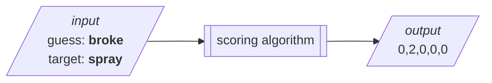
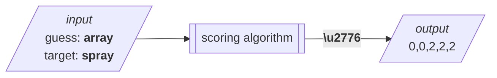
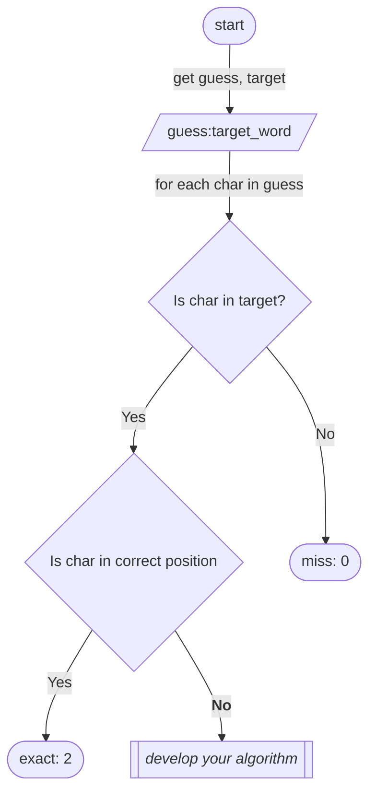

# Guess My Word
`> command line word guessing --game `
---
## Introduction
**Guess-My-Word** is a command line word guessing game inspired by [Wordle:copyright:](https://www.nytimes.com/games/wordle/index.html)

## ❗️ Tasks
You must complete the following tasks before submitting the assessment:
- [x] Read through the project requirements in the project Word document on Blackboard
- [ ] Read through this document in its entirety
- [x] Ensure you understand that you **must** keep a journal of your development progress in the Word document
- [x] Produce a plan for developing your code
- [ ] Complete all sections in this document marked with ❗️
- [ ] Complete the [code](#flow) according to the specification and ensure it passes the bundled test cases and at least one other test case you yourself developed
- [ ] Submit a `zip` file containing:
  - [ ]  the completed Word document (journal)
  - [ ]  this `readme.md` with the appropriate sections filled in
  - [ ]  a working version of your game, written in Python
  - [ ]  any and all supporting files required to run your program


## User Documentation

> **Include complete user documentation with your final submission** 
### How to play
> ❗️Ensure you include the following:
- [x] Quick overview
- [x] Objectives and rules
- [x] Game play

#### Overview 
**Guess-My-Word** is a command line clone of the popular word guessing game [Wordle](https://www.nytimes.com/games/wordle/index.html). Players are given six tries to guess a five-letter word. After each attempt, the program gives clues about the accuracy of the guess. The player uses the clues to adapt their responses.

The player must use a **valid** word in the English language for each attempt.

The game ends when the correct word is guessed (win) or when the number of attempts is exhausted (loss).

#### Objectives and rules
> ❗️Complete the user instructions for the game

#### Game play
> ❗️Provide clear instructions on how game play proceeds


## Developer Documentation
### Files and resources
The following files are included in this project:
- This `readme.md`: a description of the project and its content
- `all_words.txt`: a list of all words that can be used as guesses
-  `target_words.txt`: a list of words that can be used as *target* word of the day words. <br>These words are a subset of `all_words.txt`
-  `guess_my_word.py` the implementation of the **Guess-My-Word** game. Note that it contains clues and additional instructions.

### Program flow {#flow}
The program must do the following:
1. Select a word of the day (target_word) at random from `target_words.txt`
2. Ask user for a guess from `stdin` (i.e. input) and validate guess:
     1. Is guess length valid? 
     2. Is guess a valid word (in `all_words.txt`)?
3. Score guess using scoring algorithm (see [scoring](#scoring) )
4. Format score as a hint to the user and display on `stdout` (i.e. print). Score must show which characters in the guess are:
     1. in the correct position
     2. in the incorrect position
     3. not in the target word
5. Check if it is a win (end if True)
6. Check if there are no more tries (end if True)
7. Ask for another guess

#### Flowchart
> ❗️Include a flowchart (as `png`, `svg`, or `mermaid`) that describes the program flow.
> **Tip**: if you are not comfortable with markdown, you can use https://app.diagrams.net/ 

### ❗️ Optional features
You **must** implement at least **one** of the following *optional* features and explain why you chose it in the Word document:
- Emoji grid: when the game is complete output an 
- Track the history of target words and guesses in a file, including summary statistics (win rate, avg. number of guesses)
- Track all characters not in word and display to users
- Other? <br>If you have any other features you can propose them to your lecturer 

### Scoring guesses {#scoring}
At the core of **Guess-My-Word** is the scoring **algorithm**. The scoring algorithm takes a 5-character sequence of letters (the ***guess***) and compares it to another 5-character sequence of letters (the ***target***) and scores each character in the guess:
- **0** / Miss
  - The character in the **guess** was not found in the **target** 
- **1** / Misplaced 
  - The character in the **guess** was found in the **target** but in the wrong position
- **2** / Exact
  - The character in the **guess** was found in the **target** in the correct position 

#### Inputs and outputs

> **Note:** To view mermaid diagrams in pycharm: 
    1. Press **`⌘ ,`** (Mac) or **`Ctrl+,`** (Windows) to open the IDE settings and select  **Languages & Frameworks | Markdown**.
    2. Enable Mermaid under **Markdown extensions.**

The following diagrams demonstrate example input and output:
<br>
>:warning:   Take your time to think about **why** the output is what it is

<br><br>

<br><br>

##### ❶ complex case breakdown:
1. The *guess* (array) consists of these characters in their respective positions <br>`{0: a, 1: r, 2: r, 3: a, 4: y}` <br><br>scored against *word* (spray):<br>`{0: s, 1: p, 2: r, 3: a, 4: y}`<br><br>Gives:<br>`(0, 0, 2, 2, 2)`<br><br>

   - `(0: a)` is in the target word but there's an exact match in position 3 so <br>score: `0: 0` 
   - `(1: r)` is in the target word but there's an exact match in position 2 so <br>score: `1: 0` 
   - `(2: r)` is in the target word in the exact position so <br>score: `2: 2`
   - `(3: a)` is in the target word in the exact position so <br>score: `3: 2`
   - `(4: y)` is in the target word in the exact position so <br>score: `4: 2`

#### Algorithm specification 
> ❗️ Describe the scoring algorithm using *pseudocode*, Python, flowcharts, or some combination of these. 
> 
> Your algorithm must clearly and unambiguously describe how to arrive at the scores above and any other valid inputs.
<br>
```python
################################################
# EXAMPLE ONLY: DELETE AND WRITE YOUR OWN      #
################################################
# 1. Split characters in guess into a list
# 2. Split characters in word into a list
# 3. Do something for each character in the guess
# 4. Do something else for each character in the guess
# 5. Score each character according to this flowchart:
# <flowchart>
```
>Example flowchart (**SAMPLE ONLY**):



## Delivery roadmap
The following is a proposed roadmap for delivering the working prototype. You can use this chart or create your own:
```mermaid
gantt
    dateFormat  YYYY-MM-DD
    title       Possible Delivery Roadmap
    excludes    weekends

    section Analysis
    Project review          :a1, 2022-04-18, 1w
    Competitors             :a2, after a1, 1w
    Algorithm development   :a3, after a1, 3w 
    UX Design               :after a2, 2w
    Design sign off         :milestone,

    section Development
    Coding standards        :done, d0, 1d
    Review existing code    :d1, 2022-04-18, 1w
    Code Score Algorithm        :crit, d2, after a2, 3w
    Prototype User Interaction :d3, after d2, 1w
    Iterative development: d4, after d3, 4w
    MVP complete        :milestone, dm, after d4, 0d
    Valued add features :dv, after dm, 2w

    section Documentation
    Draft user documentation: active, u1, 2022-04-18, 3w
    Finalise documentation: u2, after dm, 2w

    section Testing
    Write test cases :t1, after u1, 1w
    All tests pass :milestone, after u2,


```

###### Note:
- Modern development is iterative, flexible, and client-centered
- Coding, testing, and documentation are merged: they are **all** development
- Analysis is interleaved with coding and is anchored in frequent interactions with the client. If possible, deliver *functional* code often, instead of detailed specifications.
- It is good practice to develop the user documentation and tests **before** code. <br>Why?
- We clearly delineate the minimal viable product (the least we need to do) from value add: things we think will be valued but are not needed for acceptance

###### Consider:
- To reduce the need for detailed specification, consider how you can subdivide your project into meaningful milestones. For example:
  - Create the user documentation and validate with the client
  - Develop a guess scorer and see if it scores guesses according to the client expectations
  - Then develop a word chooser that automatically chooses the words from the client list
  - Then create the user experience (UX) for choosing guesses
  - Finally combine into the end to end solution
- Check that the client can appreciate *business value* at each of the stages above.

## Appendix: Marking Checklist 
> The following information is for lecturers and students. It is marking criteria needed to pass this project
### All items submitted
- [x] Submitted `zip` file containing:
  - [x] Project Word document
  - [x] This `readme.md`
  - [x] `.py` file containing the program 
  - [x] Any external files (usually the `.txt` files used for the word lists)

### Word Template (Journal and Project Plan)
The Word document provides evidence that the student:
- [ ] Clarified task with required personnel
- [ ] Planned and prioritised work
- [ ] Understood the applicability of specifications, standards, and guidelines appropriate for the task
- [ ] Discussed and demonstrated the program 
- [ ] Made changes in response to feedback
- [ ] Confirmed implementation met the specifications
- [ ] Obtained sign-off

## This file
- [ ] All items marked with ❗️ have been attempted
- [ ] Demonstrates an attempt to use a formal problem solving process to:
  - [ ] Create an algorithm demonstrating program flow
  - [ ] Address core requirements
  - [ ] Identify and address edge cases
- [ ] Demonstrates and evaluates how the decision meets specification

## Program code
Your python program will demonstrate:
- [ ] It can be executed: this is the most important - it must run without interpreter errors. It does now!
- [ ] Features and capabilities from the documentation that you created
- [ ] Passes all existing doctests
- [ ] At least one new doctest has been added
- [ ] The module and all functions are clearly documented with a `docstring` 
- [ ] Comments are used sparingly and only when needed
- [ ] Code complies with key features of PEP8 (see [checklist](#pep8))


### PEP8 Cheatsheet {#pep8}

The [PEP8](https://pep8.org/) coding standard is an extensive and industry-accepted set of guidelines on how to write clear, clean, and professional Python programs. It is the standard used for Python programs developed at NMTAFE. You are **not** expected to be familiar with every element of the standard at this level, but you must follow the following subset of the standard in order to pass:
- Variable names and function names are in lowercase and words are separated with underscores ('_')
  ```python
  #Yes!
  spam = 1
  ham = 2
  def make_ham_and_spam(spam, ham)
    return ham + spam
  
  #No!
  Spam = 1
  def makeSpamAndHam(ahhhh):
      pass
    ```
- Unless a variable represents a constant (a label for a value that never changes wthin a program), then it should be `ALL_UPPERCASE = 3.14159`
- Variables should always be nouns, functions should always start with a verb.
- Use 4 spaces per indentation level (this is the default in most editors)
- Name files like you would variables: lowercase, no spaces, underscores
- Surround docstrings with three double quotes on either side, as in "­"­"This is a docstr­ing­"­"­"
- Avoid names that are ambiguous in some fonts:
    ```python
    # Warning: lecturer's tired eyes cannot tolerate
    I = 0  # can look like an l or 1 
    l = 0 # can look like an I or 1
    O = 0 # can look like a zero

    ```
- Never use whitespace between a function name and its (call) or between a collection and its subscript
    ```python
    # Correct:
    print('hello')
    # Very wrong
    print ('hello')

    # Correct:
    dct['key'] = lst[index]
    # Wrong:
    dct ['key'] = lst [index]
    ```

-  **B mndfl wt cntractions**: use contractions and acronyms sparingly and ensure readability is your priority 
- Surround the following with a single whitespace:
    ```python
    # Assignment operators (=, +=, -=, and so forth) (except when assigning in a function definition)
    # Compar­isons (==, !=, >, <. >=, <=) and (is, is not, in, not in)
    # Notice that a comparison (e.g. '!=') is a single operator even if it has two characters!)
    # For mathematical operators + - * ** % // usually we put spaces around lower precedence operators, but judgement is required. 
    # Some best practices (from https://peps.python.org/pep-0008/#whitespace-in-expressions-and-statements ):
    # Correct:
    i = i + 1
    submitted += 1
    x = x*2 - 1
    hypot2 = x*x + y*y
    c = (a+b) * (a-b)

    # Wrong:
    i=i+1
    submitted +=1
    x = x * 2 - 1
    hypot2 = x * x + y * y
    c = (a + b) * (a - b)
    ``` 
  - If you want [more](https://cheatography.com/jmds/cheat-sheets/python-pep8-style-guide/) but these are the main ones your lecturers will look at


